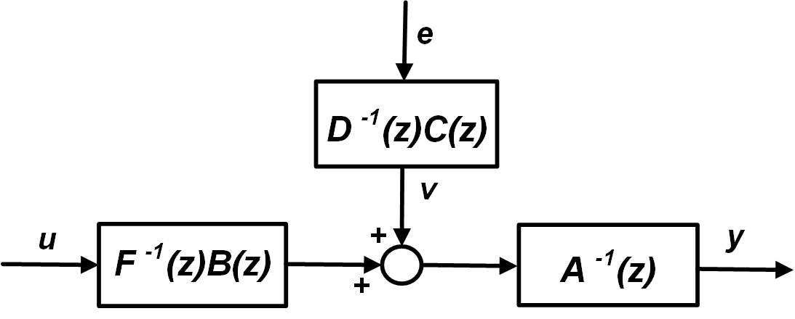

# Input-Output Linear Methods

Every identified **linear input-output** model is returned according to the following **structure**:

$$
  y_k = G(z)u_k + H(z)e_k
$$

where $G(z)$ and $H(z)$ are **transfer function matrices** of polynomials in $z$, which is the **forward shift operator**.

The underlying generalized model structure is:

$$
  A(z)y_k=\frac{B(z)}{F(z)}u_k+\frac{C(z)}{D(z)}e_k
$$

which can be visualized as **block diagram**:



For each structure, the corresponding **orders** of the various blocks have to be set, since a **specific parameter vector** ($\Theta$) and a corresponding **regressor matrix** ($\phi$, in which the various **regressor vectors** $\varphi_k$ are stacked) have to be defined [Ljung, 1999]().`

Here's a summary of all the available model structures and polynomials used:

| Model structure | $G(z)$ | $H(z)$ |
| :- | :-: | :-: |
| FIR (Finite Impulse Response) | $B(z)$ | 1 |
| ARX (AutoRegressive with eXogenous inputs) | $A^{-1}(z)B(z)$ | $A^{-1}(z)$ |
| ARMAX (AutoRegressive with Moving Average eXogenous inputs) | $A^{-1}(z)B(z)$ | $A^{-1}(z)C(z)$ |
| ARMA (AutoRegressive with Moving Average) | $A^{-1}(z)$ | $A^{-1}(z)C(z)$ |
| ARARX | $A^{-1}(z)B(z)$ | $A^{-1}(z)D^{-1}(z)$ |
| ARARMAX | $A^{-1}(z)B(z)$ | $A^{-1}(z)D^{-1}(z)C(z)$ |
| OE (Output Error) | $F^{-1}(z)B(z)$ | $1$ |
| BJ (Box-Jenkins) | $F^{-1}(z)B(z)$ | $D^{-1}(z)C(z)$ |
| GEN (Generalized) | $A^{-1}(z)F^{-1}(z)B(z)$ | $A^{-1}(z)D^{-1}(z)C(z)$ |

For example, in the case of a SISO (single-input single-output) ARMAX model, we have:

$$
  \Theta=[ a_1 \: a_2 \: ... \: a_{n_a} \: b_1 \: ... \: b_{n_b} \: c_1 \: ... \: c_{n_c}]^T \\
  \varphi_k= [    -y_{k-1} \: \dots \: -y_{k-n_a}\:   u_{k-1-\theta} \: \dots \: u_{k-n_b-\theta} \: \epsilon_{k-1} \: \dots \:   \epsilon_{k-n_c} ]^T
$$

where $\epsilon_k = y_k - \hat{y}_k$ is the **prediction error**, being $\hat{y}_k$ the **output model**, and $\theta$ is the **time-delay**.

Following naming convention for orders is used throughout SIPPY:

* $n_a$ - orders of $A(z)$: the order of $n_y$ outputs.
* $n_b$ - orders of $B(z)$: the orders of $n_y \times n_u$ input-output relations.
      Note that if an input does not influence an output, set that order equal to $0$;
* $n_c$ - orders of $C(z)$: the order of $n_y$ error models (numerator in $H(z)$).
* $n_d$ - orders of $D(z)$: the order of $n_y$ error models (denominator in $H(z)$).
* $n_f$ - orders of $F(z)$: the order of $n_y$ undisturbed output model.
* $\theta$: the $n_y \times n_u$ input-output time-delays.

Here an example for an ARMAX model for a **MIMO system** (4 inputs $\times$ 3 outputs) is illustrated.
Denoting $z^{-1}$ as the **backward shift operator**, a MISO approach is employed, that is, for each of the three outputs the identified structure is:

$$
  \begin{split}
    (1+a_1 z^{-1}+...+a_{n_a}  z^{-n_a}) y_k & = (b_{1,1} z^{-(1+\theta_1)}+...+b_{1,n_{b1}} z^{-(n_{b1}+\theta_1)}) u^{(1)}_k + \\
                                             & +(b_{2,1} z^{-(1+\theta_2)}+...+b_{2,n_{b2}} z^{-(n_{b2}+\theta_2)}) u^{(2)}_k    \\
                                             & + (b_{3,1} z^{-(1+\theta_3)}+...+b_{3,n_{b3}} z^{-(n_{b3}+\theta_3)}) u^{(3)}_k+  \\
                                             & + (b_{4,1} z^{-(1+\theta_4)}+...+b_{4,n_{b4}} z^{-(n_{b4}+\theta_4)}) u^{(4)}_k+  \\
                                             & + ... + (1+c_{1} z^{-1}+...+c_{n_{c}} z^{-n_{c}}) e_k
  \end{split}
$$


| | Output 1 | Output 2 | Output 3 |
| :- | :-: | :-: | :-: |
| Input 1 | $g_{11}=\frac{4 z^3 + 3.3 z^2}{z^5 - 0.3 z^4 - 0.25 z^3 - 0.021 z^2}$ | $g_{21}=\frac{-85 z^2 - 57.5 z - 27.7}{z^4 - 0.4 z^3}$ | $g_{31}=\frac{0.2 z^3}{z^4 - 0.1 z^3 - 0.3 z^2}$ |
| Input 2 | $g_{12}=\frac{10 z^2}{z^5 - 0.3 z^4 - 0.25 z^3 - 0.021 z^2}$ | $g_{22}=\frac{71 z + 12.3}{z^4 - 0.4 z^3}$ | $g_{32}=\frac{0.821 z^2 + 0.432 z}{z^4 - 0.1 z^3 - 0.3 z^2}$ |
| Input 3 | $g_{13}=\frac{7 z^2 + 5.5 z + 2.2}{z^5 - 0.3 z^4 - 0.25 z^3 - 0.021 z^2}$ | $g_{23}=\frac{-0.1 z^3}{z^4 - 0.4 z^3}$ | $g_{33}=\frac{0.1 z^3}{z^4 - 0.1 z^3 - 0.3 z^2}$ |
| Input 4 | $g_{14}=\frac{-0.9 z^3 - 0.11 z^2}{z^5 - 0.3 z^4 - 0.25 z^3 - 0.021 z^2}$ | $g_{24}=\frac{0.994 z^3}{z^4 - 0.4 z^3}$ | $g_{34}=\frac{0.891 z + 0.223}{z^4 - 0.1 z^3 - 0.3 z^2}$ |
| Error model | $h_{1}=\frac{z^5 + 0.85 z^4 + 0.32 z^3}{z^5 - 0.3 z^4 - 0.25 z^3 - 0.021 z^2}$ | $h_{2}=\frac{z^4 + 0.4 z^3 + 0.05 z^2}{z^4 - 0.4 z^3}$ | $h_{3}=\frac{z^4 + 0.7 z^3 + 0.485 z^2 + 0.22 z}{z^4 - 0.1 z^3 - 0.3 z^2}$  |


```python
n_a = [3, 1, 2]
n_b = [[2, 1, 3, 2], [3, 2, 1, 1], [1, 2, 1, 2]]
t_h = [[1, 2, 2, 1], [1, 2, 0, 0], [0, 1, 0, 2]]
```
